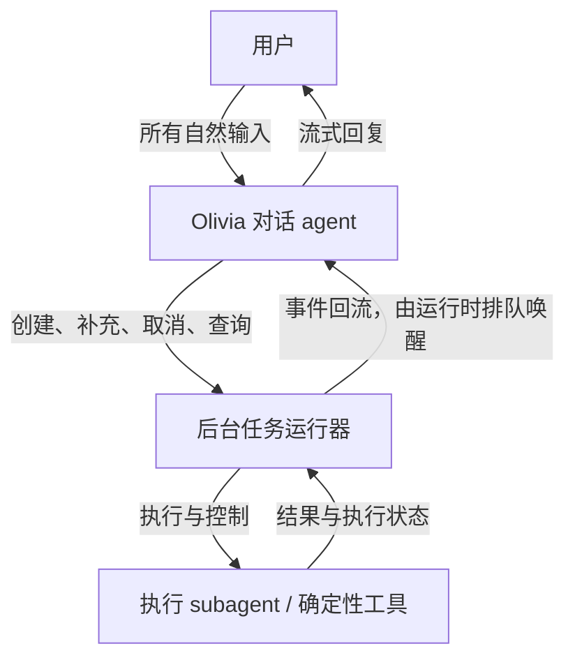
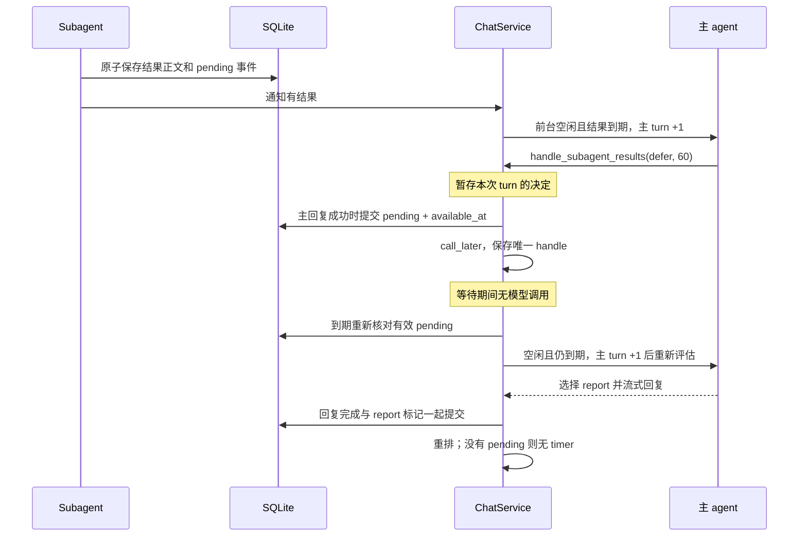
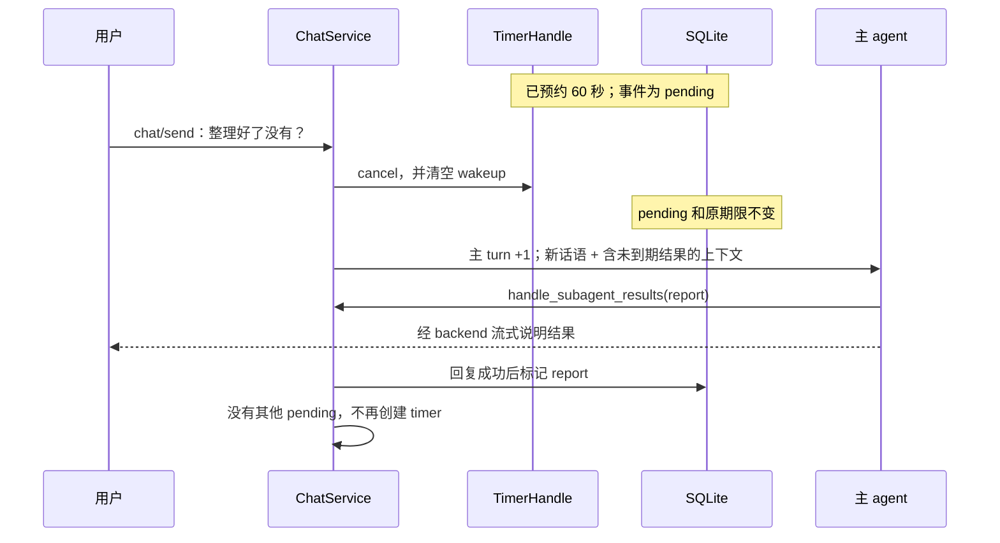

# Olivia Agent 设计：持续对话与异步执行

状态：首版持续对话、单槽 subagent、本地文件/命令执行与结果回流已实现；验收记录见运行文档。更新：2026-10-10。

本文记录产品需求、架构选择及其原因。首版实现覆盖控制工具、独立后台执行、结果排队及主 agent 唤醒；业务连接器、递归协作和 OS 沙箱不在本轮范围。当前实现与 UI 决策见 [后端总体设计](AGENT_BACKEND.md)，通信与存储约定分别见 [聊天协议](CHAT_PROTOCOL.md) 和 [历史与记忆](HISTORY_MEMORY.md)。

## 1. 决策与核心需求

采用一个面向用户的 Olivia 对话 agent，以及由它创建、补充、取消和协调的独立后台执行上下文。需要自主推理和工具循环的工作由 subagent 执行；确定性的简单操作可以由后台工具执行。主 agent 不亲自展开业务执行循环，通过同一条自然对话理解委托、交接信息并解释结果。

这项选择服务于以下强需求：

1. 工具或任务执行期间，用户仍能与 Olivia 快速交谈。
2. 新输入可以与正在执行的工作完全无关，不能一律解释为任务补充，也不能因此停止原工作。
3. 用户不需要手动创建、切换或管理多个工作对话；Olivia 自动判断话语属于闲聊、新委托，还是已有工作的补充或撤回。
4. 工作完成后，即使没有新的用户消息，Olivia 也能接回结果并主动说话。
5. 用户感知到的是同一个持续交流的 Olivia。前端只有 chat/send({text})，没有任务、轮次或 agent 控制语义；后台执行身份、turn 和工具过程不进入输入协议。

典型场景：

> 用户：帮我整理今天的会议。
>
> Olivia：好呀，我整理一下。
>
> 用户：今天真的累死了。
>
> Olivia 接住这句聊天，会议整理继续进行。
>
> 用户：对了，产品那场就别算了。
>
> Olivia 把这句补充交给已有的会议整理任务。
>
> 稍后，在合适的对话时机，Olivia 告诉用户整理结果。

成功标准是“聊天可以转向，工作仍然继续，之后还能自然接回来”。持续输出执行进展本身不足以满足这个标准。

## 2. 为什么选择这个架构

### 2.1 单一 agent loop 能实现异步，不是能力上做不到

ReAct / agent loop 描述模型如何判断、调用工具并继续执行；本设计讨论的是不同工作上下文如何调度。主 agent 与 subagent 内部都可以使用 agent loop。

单一 agent 可以发送中间回复、接收补充输入、等待后台工具，也可以由工具完成事件唤醒。主动消息同样不以多 agent 为前提。不能以“单 agent 无法异步”作为本方案的论据，也不能从其他产品的界面表现推断其内部架构。

真正的取舍在于：当用户切换话题时，后台工作是否还拥有独立上下文和生命周期，能继续进行多步推理和工具调用。如果给所谓的单 agent 加上独立工作上下文、独立执行循环和事件回流，它在这些关键边界上已经与本设计趋同。模型数量、代码里 agent 类的数量和进程数量不是判断标准。

### 2.2 备选方案与取舍

| 方案 | 优势 | 对 Olivia 的限制 | 决策 |
| --- | --- | --- | --- |
| 一个串行 loop，共享对话和工作上下文 | 实现简单，原始上下文完整，无委派损失 | 聊天与工作争用同一执行过程；长工具等待和持续推理需要让出执行机会 | 不作为目标架构 |
| 一个对话 loop，加异步普通工具 | 工具等待不阻塞聊天，适合确定性操作 | 多步自主工作仍需管理自己的进度、上下文和后续调用；只把工具后台化并不能解决这些问题 | 作为执行路径之一保留 |
| 用户手动维护多个工作对话 | 工作上下文分离，人可以明确选择处理对象 | 用户承担分发、切换和搬运上下文的成本，不符合持续陪伴的交互要求 | 不提供这种产品模型 |
| 对话 agent 自动协调独立执行上下文 | 聊天和工作独立推进；统一人设、结果出口；按任务选择上下文和推理配置 | 增加路由、交接、turn 同步和事件调度成本 | 采用 |

本设计将原本由用户完成的“建立工作上下文、选择当前对象、传递补充、取回结果”交给 Olivia。必要的隔离是对话与执行的隔离；不要求一开始就有大量 subagent、递归委派或复杂协作网络。

### 2.3 预期收益与代价

- **对话响应独立于任务耗时。** 主 agent 不等待工作完成即可继续接话，但创建委托和再次转述会增加调用开销；不承诺任务总耗时下降。
- **执行资料与日常对话分开。** 工具日志和大段资料留在执行上下文，主 agent 默认保留目标、最新约束、状态和结果；需要核对进展时可以按需读取 subagent 的全部已存历史。隔离能控制上下文混杂，不能消除交接信息损失。
- **不同职责使用不同推理配置。** 主 agent 默认关闭深度思考以降低首正文延迟，subagent 默认开启思考处理复杂执行。思考开关不代表主 agent 无需理解、判断或核对。
- **自然交互的协调成本进入系统。** 路由错误、过期结果和重复委托需要明确处理；这些是选择该架构后承担的真实工程成本。

不能只用“很快回复了一句收到”证明收益。需要同时观察接话速度、任务完成质量和补充指令是否生效。

## 3. 角色与运行时边界

下图表示语义上的交互：所有用户输入统一交给对话 agent，由它决定是否创建、补充或取消工作。事件队列、调用调度与持久化在运行时支撑这些交互，不是前置的模型路由层。



### 3.1 对话 agent

负责维持人设、理解用户当前话语、识别委托、补充及撤回、选择相关上下文、读取精简的在办事项、解释结果和决定发言方式。只有它对用户说话。运行时不根据用户文本猜测目标 subagent，也不通过关键词绕过主 agent 直接取消任务。

常驻能力必须覆盖以下内部工具；名称是方案中的语义名称，控制与持久化约定见 [历史与记忆](HISTORY_MEMORY.md#创建补充取消和查询)。这些能力不成为 UI 按钮或任务管理入口。

| 工具能力 | 主 agent 的职责 | 运行时的职责 |
| --- | --- | --- |
| `create_subagent` | 确定目标和必要上下文 | 持久化受理并启动或排队执行 |
| `steer_subagent` | 判断补充属于哪项工作，明确新要求 | 按目标 agent ID 保存补充并推进该 agent 的 turn |
| `stop_subagent` | 判断用户撤回哪项工作及范围 | 阻止后续执行，停止可中断操作并返回真实状态 |
| `get_subagent` | 按需阅读目标工作的全部历史，核对进度与结果 | 返回各 turn 消息、完整工具 payload、在途调用及作为操作凭据的调用/结果消息；查询不改变执行 |
| `handle_subagent_results` | 选择现在转述、暂缓或不再主动报告子结果 | 持久化投递决定、安排到期重新评估；不直接展示子结果 |

“只有创建工具”会导致重复创建任务，无法承接持续补充；“只有更新工具”则无法明确表达用户撤回委托。取消必须是独立控制能力，不能仅把“别做了”当成一条普通提示塞到 subagent 上下文里，等待它自行遵守。

主 agent 委派的是目标与约束；详细计划、资料探索和业务工具循环交给执行侧。这样可以控制前台判断负担，避免要求默认关闭思考的主 agent 同时完成复杂拆解。复杂结果核验也可交给执行侧，但主 agent 仍须检查结果是否回答了用户的问题，不能把“提出方案”转述成“已完成操作”。

### 3.2 执行 subagent 与普通工具

subagent 拥有独立的任务上下文、执行进度和工具循环，默认开启思考，不承担 Olivia 的日常陪聊。它不能直接向 UI 写入回复；需要澄清、失败、完成或取消状态变化都通过事件返回主 agent。

普通工具和 subagent 对调度层采用一致的异步执行语义：提交目标、确认受理、后台运行、返回事件。Agent as tool 是这一接口的一种实现。确定性操作不必为了形式统一而额外进行一次模型推理；主 agent 仍然通过运行器提交它。

共享模型适配器、工具实现或同一个 backend 进程，不影响逻辑隔离。subagent 不等于新 OS 进程，也不要求不同模型。

### 3.3 对话运行时与后台任务运行器

这是不包含模型的 backend 基础设施，负责受理、调用调度、持久化、执行上限、事件排序和 turn 检查。对话运行时的事件队列只决定何时唤醒主 agent，不理解用户意图；后台任务运行器只根据主 agent 给出的明确 agent ID 和操作递送控制。语义分发属于对话 agent，不再增加一个模型路由器。

事件队列、steer 和模型唤醒可以直接组织在对话 agent 的 runtime 中，不要求独立组件或进程。模型不能自行保证受理去重、取消生效和事件排序等运行时约束，因此仍要在代码层实现它们。

创建任务在持久化受理后立即返回，不等待 subagent 完成。主 agent 据此给出准确的受理回应；受理失败不能声称工作已经开始。无须等待后台结果再开始前台正文流。

“常驻”指角色、状态和事件入口持续可用；模型按用户输入或后台事件调用，不空转轮询。后台完成事件触发主 agent，因而不需要用户再发一句话。

前台与后台要有独立的调度机会。即使都使用异步 API，如果模型调用仍被同一把全局锁或单个执行槽串行化，也不能满足强需求。第一版预留前台处理能力并限制后台并发；共享上游配额造成的争用需要实测。

### 3.4 Agent 身份与历史：已实现的前置基础

主 agent 的 ID 固定为 1，parent_agent_id 为 NULL；subagent 使用自己的 ID，parent_agent_id 指向创建它的父 agent。无需 kind 字段，也不另设 taskId、executionId 或 contextId。第一版一项工作对应一个 subagent，steer_subagent / stop_subagent / get_subagent 直接以 agent ID 定位。

所有日常输入始终属于主 agent 1 的持续对话；消息通过 agent_id 归属，通过 role 区分 user / assistant / tool。工具历史和结果保存在各自上下文，交接引用来源消息，父子关系不自动复制全部聊天。parent_agent_id 为递归保留数据能力；当前没有开放递归运行。

前端只用 messageId 关联显示中的文字。Agent ID 与 turn 全部留在 backend；用户输入不携带 turn。每条消息有独立 ID，多次工具调用可以属于同一个 turn。turn 的完整规则见下一节，字段与事务约束见 [历史与记忆](HISTORY_MEMORY.md)。

这些身份、存储隔离和协议已实现。运行时有独立前台和一个后台执行槽，支持委派、补充、查询、取消及结果回流。具体字段与事务规则统一维护在 [历史与记忆](HISTORY_MEMORY.md)，传输契约见 [通信协议](CHAT_PROTOCOL.md)。

### 3.5 Turn：每个 agent 独立的处理轮次

**turn 表示该 agent 当前受理的处理轮次，从 0 开始、每次受理新一轮加 1。它不表示消息数、模型请求次数或工具调用次数。** 一轮可以包含多次模型请求、多次工具调用，直到完成、失败、中断或被新一轮替换。不另设 turn 表或新的执行身份；用 `(agent_id, turn)` 标识轮次。

主 agent 的用户输入受理与启动处理连在一起；子 agent 可能需要排队，因此在创建或补充受理时就分配新 turn，取得后台槽时沿用该值。这样 steer 一经受理，旧执行就立即失效，不必等新一轮真正调用模型。排队期间再补充也增加 turn，历史输入都保留，后台只执行最新轮次。

| 触发 | 主 agent turn | 目标 subagent turn |
| --- | --- | --- |
| 有效用户输入，无论前台忙闲 | +1，开始新一轮；若有旧草稿则替换 | 不变；是否补充或撤回由主 agent 判断 |
| Timer 到期，主 agent 空闲且仍有到期 pending | +1，启动主动处理 | 不变，子工作不重跑 |
| Timer 到期，主 agent 忙碌或正在受理输入 | 不变，保留事件，当前轮结束后重排 | 不变 |
| Timer 到期，但结果已处理或尚未到期 | 不变，退出或重排预约 | 不变 |
| `create_subagent` 成功受理 | 沿用正在执行的主 turn | 新子 agent 从 0 到 1，排队 |
| `steer_subagent` 成功受理 | 沿用正在执行的主 turn | +1，旧草稿失效，停止旧执行，再运行新一轮 |
| `stop_subagent` 成功受理 | 不变 | 不变，通过 cancelling/cancelled 禁止继续执行，不启动模型轮次 |
| 查询历史、工具调用/返回、继续请求模型、回复完成 | 不变 | 不变 |
| 子结果入库、安排/取消 timer、提交 report/defer/suppress | 不变 | 不变 |
| 重复操作凭据重放、进程恢复状态 | 不变 | 不变 |

只有对话服务与子 agent 调度器可以分配新 turn。Harness 接收启动时确定的 turn，整个工具循环沿用它；模型适配器只接收 messages、工具与思考设置，不接触计数或存储。

**过期的一轮直接退出，不自行重新触发。** 新用户输入先在事务中保存原话、推进主 turn、把旧草稿标记 superseded，再切换内存中的当前轮次，随后取消旧请求。即使上游不及时响应取消、继续返回正文或工具调用，也按旧 turn 丢弃。运行时在模型请求、流片段和工具执行入口校验轮次及 running 状态；落库还校验消息 ID 与 streaming 状态。已经展示的旧片段无法撤回，后续片段不会混进新消息。

丢弃的是旧轮次继续输出、开始新动作和提交最终结论的资格。已受理的委派、已完成的工具调用、文件修改等事实保留；在途外部操作若迟到返回，仍可把真实结果记录在原 turn 供核对，但不能继续下一步或冒充当前轮次成果。控制和外部操作按稳定 operation_key 去重，键保存在首次调用消息上，不能把 turn 加进键导致新一轮重复执行。调用执行前落库，结果返回后关联原消息；没有结果就保留未知事实，不另建操作表。

主 turn 与子 turn 从不互相比较。例如主 agent 正在 turn 11，子 agent 在 turn 3 完成：结果只落库，不打断主 turn 11。主 turn 11 结束后，若仍有到期结果，timer 才启动主 turn 12；子 agent 仍为 turn 3。如果用户先开口，则这句话启动主 turn 12，timer 不再另开一轮；如果 timer 已启动主 turn 12 后用户开口，则用户启动主 turn 13，旧的 turn 12 输出丢弃。不会因丢弃 turn 12 再自动创建 turn 14。

重启保留各 agent 的计数，只把未完成状态标为 interrupted；不自动重跑子执行。新的用户输入或真正获准启动的结果唤醒才推进主 turn。具体持久化约束见 [turn 的存储与事务](HISTORY_MEMORY.md#turn-的存储与事务)。

## 4. 输入分发与上下文交接

### 4.1 先理解这句话，再决定是否影响已有工作

| 输入语义 | 处理方式 | 原因 |
| --- | --- | --- |
| 无关闲聊 | 正常回应，已有工作继续 | 话题变化不表示用户撤回委托 |
| 新的独立委托 | 创建新的执行上下文，超出并发上限则排队 | 新目标不应污染旧工作 |
| 对已有工作的补充 | 更新对应工作，交付新的约束 | 保持工作的连续性，避免重新创建 |
| 明确撤回已有委托 | 对话 agent 识别目标并调用 `stop_subagent` | 用户可以自然撤回工作，无需任务控制界面 |
| 询问进展 | 读取真实任务状态并自然解释 | 不凭对话历史猜测进度 |
| 指代不清且有多个候选工作 | 用自然语言澄清目标 | 避免把修改应用到错误任务 |
| 同一句兼有聊天和工作要求 | 处理其中的工作意图，同时自然接话 | 不强迫整条消息只能属于一种类别 |

消息归属由语义和当前在办事项共同决定，不能仅用“生成期间收到”判定它是任务补充。替换对话草稿是 backend 内部机制，没有对应的前端控制方法；其取消对象不能扩展成全部后台工作。

用户用自然语言改变或撤回委托时，主 agent 把明确意图交给运行器处理。内部可以停止尚未发生的后续动作，但已经完成的外部操作不能靠取消生成回滚。UI 不增加停止按钮、任务列表或会话切换。

### 4.2 自然语言取消：判断在主 agent，执行在运行时

例如用户说“算了，刚才的别弄了”：主 agent 结合当前对话与在办事项确定所指工作，调用 `stop_subagent`，再依据工具返回自然回应。如果指代明确，不要求用户再确认一次；只有多个目标无法区分时才澄清，不能默认取消所有工作。

运行器先保存撤回意图并禁止该任务启动新步骤，再尝试中断正在进行的模型流或工具调用。取消控制不排到普通任务末尾，也不等待 subagent 下一轮推理才能生效。尚未启动的工作直接退出队列；运行中的工作需要确认停止或核对在途操作。

“已受理取消”和“工作已停止”必须分开。尚有不能立即中断的外部操作时，Olivia 应说明正在停止后续工作，不能提前声称已经全部取消。外部动作已经发生时，如实说明；撤销该动作需要独立处理，不能把取消任务解释成回滚。

取消与补充不同，也与对话内部重生成不同：补充改变工作要求，取消撤回该工作，对话内部重生成只替换当前草稿。关闭气泡不触发其中任何一种任务控制。完成与取消同时发生时，以运行器记录的顺序和执行事实核对结果；不把已完成任务改写成从未执行，也不在用户撤回后继续自动报喜。

### 4.3 主 agent 选择上下文，但不能只传一句摘要

交接应同时保留目标、相关用户原话、明确约束、必要偏好、资源引用、已授权范围和预期产物。选择性交接是为了降低无关上下文干扰；用户的限制不能因摘要而丢失。例如“先写草稿，别发送”不能压缩成“处理邮件”。

执行侧缺少材料时，通过受控的上下文补充或澄清事件请求信息，不默认获得完整日常对话。任务过程不直接写入共享的人设或长期记忆，防止一次执行的假设变成持久事实。

返回内容应区分结论、依据、产物、实际完成的动作和未完成事项。主 agent 根据当前对话转述，不直接复制内部日志。交接、结果及 turn 的数据约束见 [历史与记忆](HISTORY_MEMORY.md)。

## 5. 异步结果如何回到对话

后台工作完成与 Olivia 发言是两个独立步骤。完成事件先落库、排队，对话运行时依据前台是否忙碌等规则唤醒主 agent；主 agent 使用当前对话和结果判断是否适合发言、是否暂缓以及如何表述。运行时执行这些决定并安排后续唤醒，不用另一个模型判断聊天语义。

- **只有一条对外发言通道。** 多个执行者不直接竞争气泡，不把不同回复的 token 混在一起。
- **用户输入优先获得处理机会。** 当前正在回复时，普通后台结果先排队；新输入可以促使主 agent 调整当前草稿，后台工作仍保有自己的生命周期。
- **结果发言考虑当前话题。** 用户正在倾诉时，普通结果可以暂缓；用户直接追问该工作时，应取出可用结果。需要用户决定才能继续的事项应及时说明。
- **暂缓必须有后续检查点。** 运行器在前台空闲或延迟预算到达后重新评估待报告结果，不能只等下一条用户输入。首版允许主 agent 暂缓 1–300 秒；未处理或失败的结果按有界间隔重试，具体参数仍需交互验证。
- **合并与去重。** 短时间内的多个结果可合并到一次自然回复。被新要求替代的旧结果不当作当前结论，重复事件不能重复报喜。
- **尊重撤回。** 取消受理后撤下该任务尚未发出的普通成果通告；待报告事件保留取消原因或已被取消说明覆盖的关联，不重新唤醒为报喜。迟到结果保留为事实，需要时纳入取消结果说明。已发生的外部动作或取消失败仍应如实告知。

上下文隔离并不意味着结果永远有效。接收事件和提交回复时都需要核对来源 subagent 的当前 turn 与状态；修改要求后迟到的结果保留为执行事实，但不能冒充满足新要求的结果。若旧结果已经说出，应在后续对话中说明修正。

主动消息仍需从上游 SSE 经 JSON-RPC 流式展示。后台完成不触发工具日志展示，也不绕过用户关闭气泡的意图。具体可见性规则统一记录在 [总体设计的界面行为](AGENT_BACKEND.md#3-界面行为)。

### 5.1 Subagent 结果暂缓、Timer 与提前询问

#### 5.1.1 要解决的问题

Subagent 完成工作，不等于 Olivia 应立即打断用户。主 agent 可以通过 handle_subagent_results 选择 report、defer 或 suppress；运行时保存这个决定并负责下一次唤醒。

用户随时可以继续说话，其中既可能有“刚才整理得怎么样”，也可能只是换个话题。前端一律发送 chat/send({text})。后端不能凭这次输入到来就删除待报告结果，也不根据关键词决定是否提前报告。

核心约束：**Timer 只是可撤销、可重建的唤醒预约；数据库中的 pending 事件才是尚待处理的结果。取消 timer 不等于取消 subagent、删除结果或标记已报告。**

#### 5.1.2 状态分别在哪里

| 内容 | 位置 | 生命周期 |
| --- | --- | --- |
| Subagent 的结果正文 | SQLite messages，属于来源 subagent | 保留执行事实，即使不再主动报告也不删除 |
| 待报告事件及下次检查时间 | SQLite result_events，以来源 message_id 关联正文 | pending 直到报告、抑制或被新 turn 取代 |
| 当前回复尚未提交的处理决定 | AgentRuntime.decisions[主 turn] | 主回复成功后提交；回复被替换或失败不应用 |
| 唯一的唤醒 timer | ChatService.wakeup，asyncio.TimerHandle | 进程内临时对象；输入、重排或退出时取消 |

result_events 保存 source agent_id、turn、message_id、status、available_at 和 response_message_id。available_at 是 Unix 秒数；它表示下次允许主动检查的时间，不是保证展示时间。

Timer 不存 SQLite，也不为每个 subagent 单独建立一个。一个主 agent 共用至多一个 timer，每次从有效 pending 事件中计算下一次检查时间。

#### 5.1.3 Defer 如何形成持久化决定

例如结果消息为 result-a，主模型认为用户正在倾诉，选择暂缓 60 秒：

```json
{
  "name": "handle_subagent_results",
  "arguments": {
    "message_ids": ["result-a"],
    "action": "defer",
    "delay_seconds": 60
  }
}
```

1. 工具校验结果仍为有效 pending 事件，把决定放入当前主 turn 的 decisions，返回已受理。
2. 主模型结束本次处理。结果唤醒允许纯 defer/suppress 而没有正文；这种情况不产生空的 UI 文字流。
3. 主回复成功保存的同一个 SQLite 事务中，将事件保持为 pending，设置 `available_at = 提交时刻 + 60`，记录 response_message_id。
4. 前台变为空闲，ChatService 根据持久化事件安排 timer。

延迟从主回复成功提交时开始计算，不从子工作完成或工具返回时开始计算。若这次回复中途失败、被新输入取代或进程退出，尚未提交的 defer 不生效；原事件及原期限仍保留。工具历史中的“已受理”也不能代替数据库里的最终投递状态。

defer 的 delay_seconds 必须为 1–300 秒，不能为 0；report/suppress 填 0，运行时不应用延迟。可以再次 defer，目前没有累计最长暂缓时间。

#### 5.1.4 Timer 的创建、替换与到期

schedule_results() 是统一的重排入口：

1. 调用 cancel_result_timer()，取消旧 handle 并把 wakeup 置空。
2. 若 backend 已关闭、主回复正在生成或正在接收输入，不创建新 timer。当前回复结束时再安排。
3. 读取有效 pending 事件：事件 turn 必须仍等于来源 subagent 当前 turn，且来源不处于 cancelling。
4. 没有 pending 事件就保持 wakeup 为空。
5. 通常取最早 available_at，计算 `max(0.05, available_at - time.time())`。
6. 用 asyncio 事件循环的 call_later(delay, wake_results) 创建一次性回调，保存在 wakeup。

50 ms 是避免同步反复唤醒的最小间隔，不是产品延迟承诺。Timer 等待期间不占用模型请求，也没有空转模型轮询。

wake_results() 到期后首先清空 wakeup 引用，再重新查询状态：

- 前台忙碌或 backend 已关闭：不增加主 turn，不调用模型，事件留在数据库。当前主 turn 结束后再重排。
- 当前没有到期的有效 pending 事件：重新计算 timer；没有事件则不再预约。
- 前台空闲且有到期事件：主 turn +1，启动主 agent 的一次主动处理。子 agent 不重新执行，也不增加子 turn。

主 agent 读取最新对话和待处理结果，决定现在报告、继续 defer 或 suppress。上下文快照的 turn_trigger 明确本轮是 user_input 还是 subagent_results；工具调用后的多次模型请求沿用同一个来源。后台结果唤醒不需要新的用户输入，不能因为用户保持沉默就默认等下一句话；确有对话上的理由才暂缓。普通结果不会在 timer 回调里直接显示到 UI。

唤醒发生与首段正文到达是两个时间点。主 turn 已经启动，但模型还没有返回正文时，用户仍可发来新输入替换它；这表示用户优先，不表示运行时一直等待用户。主 agent 不能凭对话推断气泡已显示或用户已读，也不能编造“默认等下一句”的调度策略或声称自行修改了设置。



#### 5.1.5 用户提前询问时如何去掉 Timer

假设 10:00:00 成功提交 defer(60)，原定 10:01:00 再检查；用户 10:00:20 问“整理好了没有”。

**输入受理阶段只暂停自动唤醒，不猜测这句话的含义。**

1. chat/send 完成参数校验后，设置 accepting，并调用 cancel_result_timer()。
2. 旧 TimerHandle 被 cancel，wakeup 置空；result_events 仍为 pending，原 available_at 不变。
3. 保存用户输入，主 turn +1，启动主 agent 回复。若此前已在主动回复，只替换那个前台草稿，子工作与结果保留。
4. 主 agent 的 pending_results 快照包含所有有效 pending 事件，包括尚未到 available_at 的结果。这个时间约束的是无人询问时的主动唤醒，不禁止回答用户的主动追问。
5. 主 agent 理解用户确实在追问结果，按需 get_subagent 核对完整历史，调用 handle_subagent_results(report)，随后流式自然回答。
6. 只有回复成功保存后，才把对应事件标为 report。finish() 再检查剩余 pending：没有就清空 timer；还有其他结果就为它们重新安排唯一 timer。



这里有两个不同时间点：**收到输入时取消物理 timer；回复成功且明确处理结果时，才消费逻辑事件。** 中间没有“因为用户问过了就先把结果删掉”的步骤。

#### 5.1.6 提前输入后的其他情况

| 情况 | 事件与 timer 如何处理 |
| --- | --- |
| 用户只是无关聊天，主 agent 没有处理该结果 | 原 pending、原 available_at 保留；回复结束后重建 timer，不把未来期限重新推迟 60 秒 |
| 主 agent 再次 defer | 成功提交后使用新的 available_at，撤销旧预约并重新安排 |
| 主 agent suppress | 成功提交后不再主动投递该结果；正文仍可通过 get_subagent 查询 |
| 主 agent 只调用 get_subagent 查看结果 | 查询不消费事件；要确认本次已转述，仍需 report 决定与回复成功提交 |
| 主 agent 已选择 report，但回复失败或被新输入打断 | report 决定不应用，事件继续 pending；后续回复或 timer 仍能处理它 |
| 只报告多个结果中的一个 | 为剩余 pending 重新计算 timer，不连带清除其他结果 |
| 用户发送无效输入 | 参数校验失败，不取消现有 timer |
| steer_subagent 或 stop_subagent 使旧结果失效 | 旧 pending 被抑制；重排时排除，迟到 callback 也重新查库 |

前台成功回复后，如果存在本轮已看到、已到期但未处理的结果，当前实现安排 30 秒后重试；前台失败后为 60 秒。这是运行时的重试策略，与模型明确选择的 defer 不同。

这些重试间隔只应用于已到期结果，不得把另一条未来结果更早的 available_at 一起拖后。例如 A 已到期需 30 秒后重试，B 在 5 秒后到期，唯一 timer 取 5 秒。到时主 agent 会看到全部有效 pending，可合并处理。新结果或新的对话处理会重新计算安排，因此 30/60 秒不是每条结果持久化的独立冷却期。

#### 5.1.7 输入与 Timer 同时到达

所有对话调度和 SQLite 操作在同一个 backend asyncio 线程中进行；同步状态修改不会在中途被另一段回调抢占。生成过程在等待模型时让出执行机会。

- 输入先处理：先设 accepting 并取消 timer，建立当前主回复。到期回调即使进入，也会看到前台忙碌，不增加主 turn、不额外启动主模型。
- Timer 先处理：先建立主动主回复。随后输入再次推进主 turn，先使主动回复失效，再取消其请求并保留新用户原话。迟到输出丢弃，不会自己重启。其未提交的结果决定失效，事件仍可供新回复处理。
- 报告提交先完成：事件已不再 pending；随后发生的调度查库时不再对它发起主动回复。

Timer 不识别语义，也不记住“用户正在问哪个 subagent”。语义归属仍由主 agent 判断。

#### 5.1.8 重启与显示边界

TimerHandle 只在当前进程有效。关闭 backend 会取消 handle 并清空引用；待报告结果和已经提交的 available_at 留在 SQLite。启动通知 backend/ready 后调用 schedule_results()，未到期继续等待，过期则安排一次检查。没有单独的常驻 daemon，桌宠退出期间不会调用模型。

持久化期限使用墙上时钟，进程 timer 使用事件循环单调时钟。到期会再次检查墙上时间；系统调时或休眠会影响实际检查时刻，当前不承诺严格实时唤醒。

主 agent 发言与用户看到气泡仍是两件事：正文经 SSE → JSON-RPC → UI；用户手动关闭气泡后保持隐藏，阅读中的新文字按展示规则暂存。report 表示对应主回复已成功持久化，不等于用户已经读过。

主回复保存与前端展示没有跨进程事务。若 backend 在保存回复后、通知 UI 前退出，记录会是 report，但用户可能尚未看到；当前没有展示确认协议。被打断的草稿若已有片段显示，随后结果重新转述也不构成严格的“用户只看见一次”保证。

#### 5.1.9 实现位置与验证

| 位置 | 职责 |
| --- | --- |
| backend/runtime.py：control / decorate | 暂存模型决定；向主 agent 提供含未到期事件的上下文 |
| backend/storage.py：events / event_decisions / complete_with_events | 持久化和过滤事件；主回复与投递决定原子提交 |
| backend/service.py：cancel_result_timer / schedule_results / wake_results | 单 timer 的清理、重建与到期检查 |
| backend/service.py：handle / finish / close | 新输入、回复终态和退出时衔接 timer 生命周期 |
| backend/__main__.py：serve | 启动后恢复唤醒安排 |
| tests/test_agent_result_timer.py | 提前询问、无关聊天、失败、多个结果、输入竞争及 timer 清理回归 |
| tests/test_agent_runtime.py | 到期后再次评估、静默 defer、重启恢复、结果回复被输入替换 |

## 6. 独立生命周期与恢复边界

对话草稿、后台工作、结果事件分别具有生命周期。对话生成结束、在内部被替换 或气泡被关闭，都不能等价于后台工作结束。后台工作结束也不等价于结果已经告知用户。

这项分离是为了避免三个问题：取消旧草稿时误杀任务；重生成对话时重复创建任务；程序在“任务完成但还没说出来”之间退出后丢失结果。

第一版继续由桌宠启动本地 backend，隐藏时继续运行，完全退出时停止本地执行并保存状态。此次决策不包含脱离桌宠进程的常驻 daemon。重启后不盲目重放有副作用的操作，优先恢复可核对的状态和未报告的结果。

Agent turn、受理去重、事件投递和恢复语义应由运行器与存储保证，不依赖 prompt 约定。协议与存储细节分别维护，避免在架构文档中出现第二套不一致的数据定义。运行时的工作记录只是内部实现，不能要求用户或前端把对话组织成任务。

## 7. 第一版落地范围

首版实现保留 agents / messages，主 agent 固定为 1；前端只发送 chat/send({text})；turn 与 agent 身份完全内聚在 backend。本轮覆盖：

1. 保留现有本地 backend、UI、人设与 SSE 流式链路，拆分对话执行和后台工作的生命周期。
2. 增加主 agent 的创建、补充、取消和查询能力，以及独立上下文的执行 subagent。默认一个后台执行槽位，前台对话拥有独立处理能力；更多工作可以排队。
3. 增加最小在办事项视图供主 agent 使用、结果事件回流，以及不依赖新用户输入的主 agent 唤醒。
4. 在现有 turn 过滤和历史恢复基础上，增加 subagent 控制去重、结果持久化投递与退出恢复。
5. 用代表性场景验证后，再决定是否扩大后台并发与增加复杂协作。

第一版不包含递归创建 subagent、跨任务自动依赖规划、多个 agent 同时修改共享资源、任意主动闲聊或独立后台 daemon。此次“主动说话”首先覆盖已受理委托的完成、失败和必要澄清。

## 8. 验证方式与尚未定案的参数

以下为验收场景；自动化及真实模型验证范围以 [运行与测试](CHAT_TESTING.md) 为准，不能把测试替身的工具选择当成自然语言理解准确率：

| 场景 | 应验证的行为 |
| --- | --- |
| 长工具运行时突然闲聊 | 前台流式接话，后台继续；不是只有一条固定“请稍等” |
| subagent 正在多步推理时聊天 | 两侧都能获得模型执行机会，无全局串行锁阻塞 |
| 主 agent 多次回复及重启 | 同一 agent 的 turn 单调递增，用户消息 turn 为 NULL（基础回归已覆盖） |
| 主子 agent 历史读取 | 按 agent ID 隔离，父子计数独立（存储回归已覆盖） |
| 闲聊后补充原委托 | 补充到正确工作，不新建重复任务，无关聊天不进入执行上下文 |
| 用户说“刚才的别弄了” | 主 agent 定位目标并取消，无关工作继续；明确意图无需重复确认 |
| 多个工作时撤回指代不清 | 主 agent 自然澄清，不猜测或取消全部任务 |
| 取消排队或正在执行的工作 | 队列工作不再启动；运行工作停止后续步骤，不把受理当成已经停止 |
| 取消遇到完成或在途外部操作 | 核对真实状态，不虚构回滚，不在撤回后继续报喜 |
| 新话语触发内部重生成时委派已受理 | 旧草稿被替换，已受理任务不丢失也不重复创建 |
| 新约束与旧结果同时到达 | 按来源 agent 的 turn 和状态识别过期结果，不报告旧 turn 的成功 |
| 没有新用户输入时任务完成 | 事件能唤醒主 agent，流式输出结果 |
| 多个结果同时到达或事件重投 | 单一发言通道、有序合并、无重复通知 |
| 用户主动关闭气泡后完成 | 保存结果，不擅自重新展开气泡 |
| 完成后、告知前退出并重启 | 结果可恢复，外部操作不因恢复而盲目重放 |
| 执行失败或需要材料 | 主 agent 如实解释并自然询问，不伪装成功 |

测量前台空闲与后台繁忙时的首正文延迟、补充指令应用延迟、委托成功率、重复执行率、结果报告延迟、总耗时和模型开销。当前没有系统性的性能对比或路由准确率数据，不宣称性能或成本收益已经得到验证。

首版主子 agent 共用本地模型配置，分别关闭/开启思考；后台并发上限的扩容条件、结果延迟参数和上下文容量策略留待使用验证；“一个对话主体 + 独立执行上下文”的边界已确定。重新评估架构应依据实际路由准确率、交接损失和前台响应表现，不能仅依据 agent 数量。

## 9. 本轮本地执行选择

用户选择本轮接入本地文件与任意 shell。子 agent 获得 read_file、write_file 和 run_shell，主 agent 仍只使用协调工具。shell_enabled 由被 Git 忽略的本地配置开启；工作目录不是安全沙箱。第一版没有命令审批界面，执行者必须遵守主 agent 交接的授权范围。确定性异步工具独立提交入口尚未单独开放，当前本地工具在子 agent loop 内执行。

工具调用消息携带稳定键，关联的结果消息提供去重依据；缺结果表示需要核对。它们不提供对不同键的语义等价判断，也不提供跨进程崩溃的外部副作用 exactly-once 保证。
