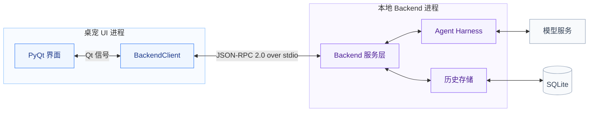

# 桌宠与本地 Agent Backend 总体设计

状态：首版聊天已实现，验证记录见 [运行与测试](CHAT_TESTING.md)。

总体方案确认：2026-10-08。实现更新：2026-10-08。

## 1. 产品模型与范围

根本设计：这是用户与 Olivia 持续、自然地说话。界面不提供“停止生成/取消任务”等任务控制入口，也没有 thread、创建会话或切换会话。补充输入是自然对话的一部分，取消旧生成仅是内部实现。此约束同时记录在项目根目录 AGENTS.md。界面输入文字，人物旁的漫画气泡流式展示回复；生成期间再发送是 steer：将补充加入当前对话，取消旧草稿并重新生成。

首版包括本地 backend、Qt 客户端、Ark 模型接入、SQLite 历史和全量上下文。图片、语音、实际音乐播放、主动开口、工具执行、历史浏览界面及记忆检索尚未实现。

## 2. 总体架构

两个大框代表两个本地进程，框内是模块，SQLite 是本地文件而非独立服务。

服务层包含 RPC 接入和聊天执行管理。模型服务使用用户指定的方舟 endpoint；harness 当前只组织上下文并流式调用模型，不包含工具循环。Backend 内模块通过普通接口连接，跨进程只使用 JSON-RPC over stdio。

| 所属 | 模块 / 文件 | 职责 |
| --- | --- | --- |
| UI 进程 | `pet.py`、`speech_bubble.py` | 输入、人物表现、漫画气泡、滚动、状态和恢复草稿 |
| UI 进程 | `backend_client.py` | QProcess 生命周期、协议编解码、受理请求队列、生成版本过滤 |
| Backend 进程 | `backend/__main__.py` | JSONL 接入、协议校验、分发、退出清理 |
| Backend 进程 | `backend/service.py` | 聊天调度、steer、取消、执行状态和持久化协调 |
| Backend 进程 | `backend/harness.py` | 最小 AgentHarness、Ark 流式适配、离线测试模型 |
| Backend 进程 | `backend/context.py` | 可替换的 ContextProvider，当前实现全量成功历史上下文 |
| Backend 进程 | `backend/storage.py` | SQLite 记录、事务、检查点、分页和恢复 |
| Backend 配置 | `backend/config.py`、`prompts/olivia.md` | 环境变量 / 本地配置、角色提示词 |

## 3. 界面行为

- 气泡是由人物窗口拥有的独立 Qt 工具窗口，与人物处于同一 UI 进程，原有 450 × 620 人物窗口不缩放。
- 位于头部旁边，采用椭圆轮廓和柔和漫画尖角；随人物移动，在屏幕边缘切换左右并限制在可用区域内。
- 气泡依据字体排版与文字量自动增长：等待和短句从 140 × 88 起步，最大 360 × 320；仅超过最大容量后显示滚动条。正文在椭圆内居中布局，支持选中和复制，向上阅读时不强制滚到末尾。
- 完成后默认 30 秒自动收起；鼠标悬停、正文获得焦点、选中文字或向上滚动阅读时暂停计时。生成期间及人物隐藏期间也不计时。`bubble_seconds` 可调。
- 等待时只显示轻微跳动的省略号，不显示任务状态标题。气泡没有关闭叉号或其他按钮。右键菜单合并为“关闭对话 / 展开对话”，随当前显示状态切换；卡片“对话”入口使用相同逻辑。关闭只收起气泡，后台继续输出，完成时不会自行重新弹出。
- 生成期间保持输入可用；补充受理后清空旧草稿，展示新版本。气泡和右键菜单均不提供停止入口。
- 失败和中断保留已有文字并展示状态。受理失败恢复输入草稿；右键可以重新连接或把上次聊天输入填回输入框重试。

## 4. 执行与进程生命周期

UI 使用当前 Python 解释器启动 `python -u -m backend`。Backend 的 asyncio 事件循环串行处理控制请求，以可取消任务执行模型流；生成期间仍能处理历史查询和 steer。

应用启动后连接 backend；隐藏到托盘时继续运行；彻底退出时关闭 stdin，取消生成并落库。若子进程未及时退出，UI 依次终止和强制结束。Backend 异常退出后 UI 结束等待，允许用户手动重新连接，不自动重发已发送输入。

同一数据库只允许一个 backend 写入，通过文件锁约束。先启动的实例继续工作，后启动的实例报告无法连接。

## 5. 模型与角色

使用 OpenAI Python SDK 的 `AsyncOpenAI` 接入方舟 Chat Completions：

- base URL：`https://ark.cn-beijing.volces.com/api/v3`
- model / endpoint：`ep-20260624173305-44d54`
- `stream=True`，方舟通过 HTTP SSE（`text/event-stream`）持续返回；每段正文立即转换为 JSON-RPC `chat/delta` 并 flush 到 UI，不等待整段完成。
- 日常聊天默认 `thinking.type=disabled`，避免深度思考阶段延迟正文；可通过配置覆盖。首次排查的同一条短消息样本，默认模式首正文 24.8 秒，关闭思考后 2.9 秒。该值是单次测量，不是延迟承诺。
- Key 读取 `ARK_API_KEY`，也支持被 Git 忽略的本地 JSON 配置；环境变量优先。SDK 不自动重试。

角色 prompt 独立存放，可修改后重启。公开人设参考与本项目补充的口吻分开记录在 [PERSONA.md](PERSONA.md)。

## 6. 通信协议

普通请求只确认受理，正文增量和完成状态通过通知返回。`chatId` 表示一次回复过程；`generation` 标记 steer 后的新版本，不是会话编号。

支持 `initialize`、`chat/send`、`chat/steer`、`history/list`，另保留仅供内部/测试的 `chat/cancel`；通知为 `chat/started`、`chat/delta`、`chat/completed`。

消息示例、时序图、错误码、取消与断开语义见 [通信协议细节](CHAT_PROTOCOL.md)。

## 7. 历史与记忆

SQLite 持久化原始消息及执行状态，UI 不直接读写数据库。启动时加载全部历史，模型上下文使用所有成功交互和当前用户输入；steer 的旧草稿保留审计记录但不再进入模型上下文。

通过 `ContextProvider` 接口留出记忆系统替换点。当前不做裁剪或摘要，超出上游上下文限制时明确报错。

字段、状态转换、文件位置和抽象接口见 [历史与记忆系统](HISTORY_MEMORY.md)。

## 8. 后续演进

后续按实际需要增加记忆检索/摘要、历史界面、主动消息、语音和工具。当前协议没有多条 assistant 消息并行输出、跨设备同步或脱离 UI 的常驻 daemon。

运行配置、测试命令及验证范围见 [CHAT_TESTING.md](CHAT_TESTING.md)。
