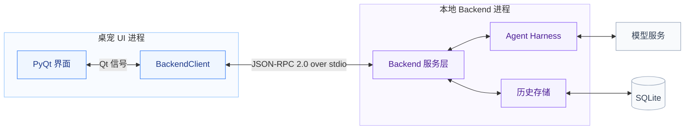

# 桌宠与本地 Agent Backend 总体设计

状态：持续聊天、agent 历史与生成版本已实现，验证记录见 [运行与测试](CHAT_TESTING.md)。

Agent 身份、历史归属与协议基础已实现；异步执行方向已确认但尚未实现：采用一个 Olivia 对话 agent 协调独立后台执行上下文。强需求、单一 loop 的备选分析、选择原因和落地范围见 [Agent 架构决策](AGENT_ARCHITECTURE.md)。下文现有实现与未来设计分开标注。

总体方案确认：2026-10-08。实现更新：2026-10-09。

## 1. 产品模型与范围

根本设计：这是用户与 Olivia 持续、自然地说话。界面不提供“停止生成/取消任务”等任务控制入口，也没有 thread、创建会话或切换会话。补充输入是自然对话的一部分，取消旧生成仅是内部实现。此约束同时记录在项目根目录 AGENTS.md。界面只把文字通过 chat/send 送给 Olivia，并流式显示她的话。当前 backend 在新输入到来时自行调整尚未完成的草稿；前端不区分新话题和补充，也不参与生成控制。

当前包括本地 backend、Qt 客户端、Ark 模型接入、SQLite 历史和全量上下文。图片、语音、实际音乐播放、主动开口、工具执行、历史浏览界面及记忆检索尚未实现。

## 2. 总体架构

两个大框代表两个本地进程，框内是模块，SQLite 是本地文件而非独立服务。

服务层包含 RPC 接入和聊天执行管理。模型服务使用用户指定的方舟 endpoint；harness 当前只组织上下文并流式调用模型，不包含工具循环。Backend 内模块通过普通接口连接，跨进程只使用 JSON-RPC over stdio。

| 所属 | 模块 / 文件 | 职责 |
| --- | --- | --- |
| UI 进程 | `pet.py`、`speech_bubble.py` | 输入、人物表现、漫画气泡、滚动、状态和恢复草稿 |
| UI 进程 | `backend_client.py` | QProcess 生命周期、统一文本发送、受理确认和消息显示通知 |
| Backend 进程 | `backend/__main__.py` | JSONL 接入、协议校验、分发、退出清理 |
| Backend 进程 | `backend/service.py` | 聊天调度、steer、取消、执行状态和持久化协调 |
| Backend 进程 | `backend/harness.py` | 最小 AgentHarness、Ark 流式适配、离线测试模型 |
| Backend 进程 | `backend/context.py` | 可替换的 ContextProvider，当前按 agent 组织全量有效历史 |
| Backend 进程 | `backend/storage.py` | SQLite 记录、事务、检查点、分页和恢复 |
| Backend 配置 | `backend/config.py`、`prompts/olivia.md` | 环境变量 / 本地配置、角色提示词 |

## 3. 界面行为

- 气泡是由人物窗口拥有的独立 Qt 工具窗口，与人物处于同一 UI 进程，原有 450 × 620 人物窗口不缩放。
- 位于头部旁边，采用椭圆轮廓和柔和漫画尖角；随人物移动，在屏幕边缘切换左右并限制在可用区域内。
- 气泡依据字体排版与文字量自动增长：等待和短句从 140 × 88 起步，最大 360 × 320；仅超过最大容量后显示滚动条。正文在椭圆内居中布局，支持选中和复制，向上阅读时不强制滚到末尾。
- 完成后默认 30 秒自动收起；鼠标悬停、正文获得焦点、选中文字或向上滚动阅读时暂停计时。生成期间及人物隐藏期间也不计时。`bubble_seconds` 可调。
- 等待时只显示轻微跳动的省略号，不显示任务状态标题。气泡没有关闭叉号或其他按钮。右键菜单合并为“关闭对话 / 展开对话”，随当前显示状态切换；卡片“对话”入口使用相同逻辑。关闭只收起气泡，后台继续输出，完成时不会自行重新弹出。
- 显示回复期间输入始终可用，发送动作保持一致；backend 发来新的消息开始通知时切换气泡内容。气泡和右键菜单均不提供停止入口。
- 失败和中断保留已有文字并展示状态。受理失败恢复输入草稿；右键可以重新连接或把上次聊天输入填回输入框重试。

### 异步执行后的界面约束（设计已确认，未实现）

- 始终只有 Olivia 的自然对话出口；subagent 不直接输出到气泡，不引入工作对话切换、任务标题、停止按钮或技术执行状态。
- 执行期间输入保持可用，用户可以聊完全无关的话题。替换前台回复草稿不影响无关的后台工作，也不改变人物素材与几何。
- 主动回复通过同一条 SSE → JSON-RPC → UI 流式链路展示；后台事件由调度器排队，不允许多个回复同时向气泡追加文字。
- 用户主动“关闭对话”后，后台工作和结果保存继续，完成事件不重新展开气泡；重新展开时可查看最新有效回复。隐藏到托盘也不因结果强行显示人物。
- 未主动关闭且人物可见时，允许结果回复在调度器选定的时机展示；它可以结束正常的自动收起状态，但不能覆盖用户正在阅读的内容。阅读结束后再展示排队回复，避免抢占阅读。

这些规则让后台独立推进，同时保持用户对可见性与阅读节奏的控制。主动生成、结果持久化与气泡可见是独立状态。

## 4. 执行与进程生命周期

UI 使用当前 Python 解释器启动 `python -u -m backend`。Backend 的 asyncio 事件循环串行接收文字，模型流以可中断的内部协程执行；生成期间仍可接收新话语，由主对话服务决定是否替换当前草稿。

应用启动后连接 backend；隐藏到托盘时继续运行；彻底退出时关闭 stdin，取消生成并落库。若子进程未及时退出，UI 依次终止和强制结束。Backend 异常退出后 UI 结束等待，允许用户手动重新连接，不自动重发已发送输入。

同一数据库只允许一个 backend 写入，通过文件锁约束。先启动的实例继续工作，后启动的实例报告无法连接。

## 5. 模型与角色

使用 OpenAI Python SDK 的 `AsyncOpenAI` 接入方舟 Chat Completions：

- API key、base URL 和 model / endpoint 全部读取被 Git 忽略的 `.olivia.local.json`，字段为 api_key、base_url、model；代码与示例文件不内置实际接入地址或接入点。
- `stream=True`，方舟通过 HTTP SSE（`text/event-stream`）持续返回；每段正文立即转换为 JSON-RPC `chat/delta` 并 flush 到 UI，不等待整段完成。
- 日常聊天默认 `thinking.type=disabled`，避免深度思考阶段延迟正文；可通过配置覆盖。首次排查的同一条短消息样本，默认模式首正文 24.8 秒，关闭思考后 2.9 秒。该值是单次测量，不是延迟承诺。
- 环境变量 ARK_API_KEY、ARK_BASE_URL、ARK_MODEL 可覆盖本地对应字段。缺少必填项时明确提示补全，不回退到某个默认服务；SDK 不自动重试。

角色 prompt 独立存放，可修改后重启。公开人设参考与本项目补充的口吻分开记录在 [PERSONA.md](PERSONA.md)。

## 6. 通信协议

前端只有 `chat/send({text})`，在 Olivia 说话前、说话中和说完后完全相同。响应只确认受理。启动由 backend/ready 通知，正文由 chat/started、chat/delta、chat/completed 通知返回；messageId 仅用于把文字显示到正确消息。

Agent ID 和 generation 是后端内部信息，不进入前端协议；没有前端补充、取消、选 agent 或查询内部历史的方法。主 agent 自己接收持续输入并维护生成，UI 只发送话语、显示话语。

消息示例、错误与断开语义见 [通信协议](CHAT_PROTOCOL.md)。

## 7. 历史与记忆

SQLite 用 agents 和 messages 保存身份、父子关系与各自历史，主 agent 为 1，parent_agent_id 为空；子 agent 指向父 agent，无 kind 字段。UI 不直接读数据库。模型上下文按 agent 筛选有效消息，用户输入始终保留，失败/中断/被替换的模型草稿只保留审计记录。主 agent 持续对话不按每次回复创建新 chat。

通过 `ContextProvider.build(agent_id)` 留出记忆系统替换点；模型适配器仍只接收模型消息，不依赖数据库结构，人物和气泡只消费客户端信号。当前不做裁剪或摘要，超出上游上下文限制时明确报错。

字段、状态转换、文件位置和抽象接口见 [历史与记忆系统](HISTORY_MEMORY.md)。

## 8. 后续演进

下一阶段按 [Agent 架构决策](AGENT_ARCHITECTURE.md) 增加对话与执行隔离、异步委派、任务补充和结果驱动的主动消息。身份与历史重构已经完成；尚未实现的工具控制、取消和结果投递语义在通信/存储文档的下一阶段章节维护。

记忆检索/摘要、历史界面和语音仍按实际需要演进。目标架构保持单一对外发言通道，不要求多条 assistant 消息同时输出。当前不支持跨设备同步或脱离 UI 的常驻 daemon。

运行配置、测试命令及验证范围见 [CHAT_TESTING.md](CHAT_TESTING.md)。
