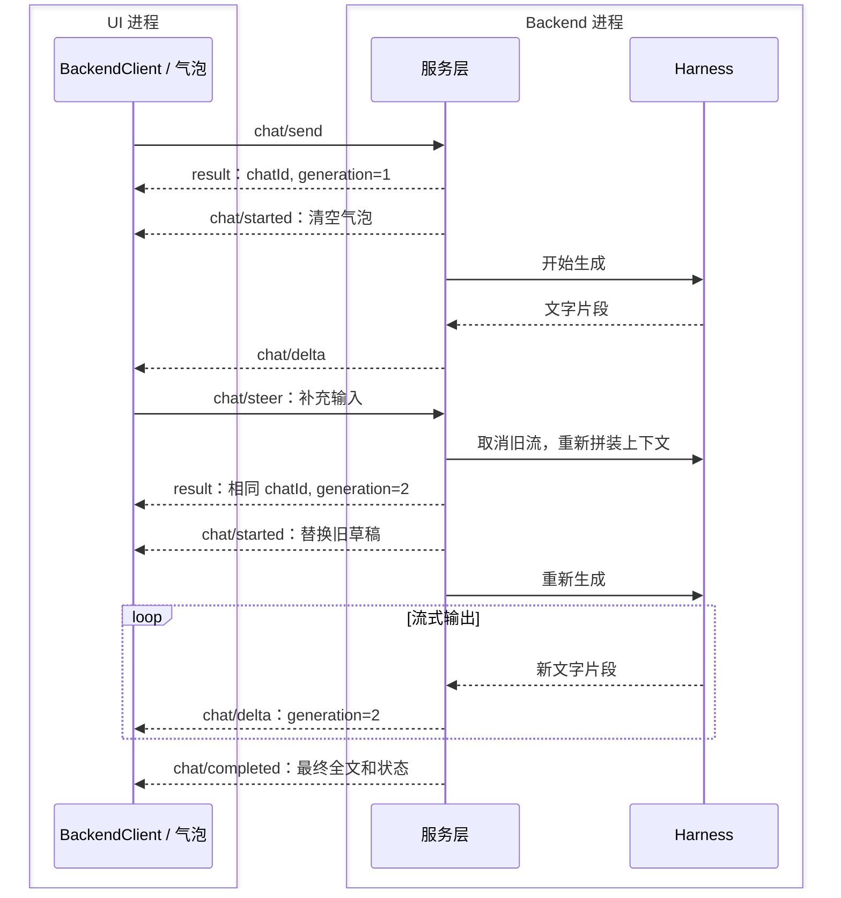

# 桌宠聊天通信协议 v1

状态：已实现。更新：2026-10-08。总体架构见 [AGENT_BACKEND.md](AGENT_BACKEND.md)。

## 传输

UI 的 `BackendClient` 使用 `QProcess` 启动 `python -u -m backend`。stdin 接收请求，stdout 返回响应与通知，stderr 仅用于诊断。编码为 UTF-8，每行一个 JSON-RPC 2.0 对象（JSONL）。正文换行必须在 JSON 字符串中转义。

请求带顶层 `id`，返回相同 `id` 的 `result` 或 `error`；通知不带顶层 `id`，接收方不回复。普通方法也可按 JSON-RPC 通知发送，但 UI 的业务请求均使用带 ID 的形式，以确认受理或获得错误。暂不支持 batch 和位置参数数组；`params` 必须是对象。

UI/Backend 间的该协议与方舟 API 是两层独立协议。方舟使用 Chat Completions 的 HTTP SSE（`stream=True`，响应 `text/event-stream`），backend 将每个正文片段立即转成下述通知并 flush，不向 UI 暴露 SDK 对象、认证信息或模型内部思考内容。

## 初始化和标识

```json
{"jsonrpc":"2.0","id":1,"method":"initialize","params":{}}
{"jsonrpc":"2.0","id":1,"result":{"protocolVersion":1,"capabilities":["streaming","steer","history","cancel"]}}
```

- `id`：仅关联本连接内一次 RPC 请求及响应。
- `chatId`：一次用户输入及其连续补充组成的回复过程，对应 `chat_runs.id`。不是 thread，不是用户可创建/切换的会话。
- `generation`：同一次回复过程内从 1 开始的生成版本。每次 steer 增加 1。
- `messageId`：本版 assistant 草稿的稳定标识；每次重新生成获得新 ID。

UI 只接收与当前 `chatId + generation + messageId` 一致的通知，丢弃被替换版本的迟到消息。所有内容必须先收到受理响应再开始通知。`chat/started` 表示新版本的起点，UI 清空旧草稿，进入等待首段文字状态。

## 发送、增量、完成

```json
{"jsonrpc":"2.0","id":2,"method":"chat/send","params":{"text":"陪我聊会儿"}}
{"jsonrpc":"2.0","id":2,"result":{"chatId":"c1","generation":1,"messageId":"m2"}}
{"jsonrpc":"2.0","method":"chat/started","params":{"chatId":"c1","generation":1,"messageId":"m2","reset":true}}
{"jsonrpc":"2.0","method":"chat/delta","params":{"chatId":"c1","generation":1,"messageId":"m2","text":"好呀，"}}
{"jsonrpc":"2.0","method":"chat/delta","params":{"chatId":"c1","generation":1,"messageId":"m2","text":"今天过得怎么样？"}}
{"jsonrpc":"2.0","method":"chat/completed","params":{"chatId":"c1","generation":1,"messageId":"m2","status":"completed","text":"好呀，今天过得怎么样？"}}
```

`text` 输入会去掉首尾空白，长度为 1–10000 个字符。`chat/send` 仅在没有运行中的回复时受理；否则返回 `-32001`。受理前先在 SQLite 事务中保存执行记录、用户消息和空 assistant 草稿。

`chat/delta.text` 是追加片段；`chat/completed.text` 是权威全文，用于校准/替换气泡正文，不能重复追加。`chat/completed.status` 为 `completed`、`failed` 或 `interrupted`。最终记录写入成功后才通知完成。

## Steer：补充上下文并重新生成

UI 在上一版还在生成时再次发送，使用 `chat/steer`：

```json
{"jsonrpc":"2.0","id":3,"method":"chat/steer","params":{"chatId":"c1","text":"补充：别推荐曲目，聊聊电影吧"}}
{"jsonrpc":"2.0","id":3,"result":{"chatId":"c1","generation":2,"messageId":"m4"}}
{"jsonrpc":"2.0","method":"chat/started","params":{"chatId":"c1","generation":2,"messageId":"m4","reset":true}}
{"jsonrpc":"2.0","method":"chat/delta","params":{"chatId":"c1","generation":2,"messageId":"m4","text":"那我们聊聊电影。"}}
{"jsonrpc":"2.0","method":"chat/completed","params":{"chatId":"c1","generation":2,"messageId":"m4","status":"completed","text":"那我们聊聊电影。"}}
```

服务端串行处理请求，取消旧模型任务，关闭其流；把旧草稿标记为 `superseded`，追加用户补充，再新建 assistant 草稿。上下文包含原始输入和历次补充，不包含被替换的 assistant 文本。旧版本不再发送完成通知，新版 `chat/started` 替代它；整次回复过程只由最终有效版本结束。

客户端允许连续编辑和发送，只串行等待每次 RPC 受理，不等待生成完成。多个快速补充依次进入相同回复过程。如果服务端在 steer 到达前已经完成，返回 `-32002`，UI 把该输入恢复到草稿，提示重新发送，不擅自创建新轮或重复执行。



## 内部取消和历史查询

产品界面不提供停止/取消按钮或菜单，后端取消主要服务于 steer、退出清理和测试。保留的内部接口 `chat/cancel` 接收 `{chatId}`，响应 `{}`，随后发送状态为 `interrupted`、错误码为 `cancelled` 的 `chat/completed`，保留已生成文本。若已经结束则返回 `-32002`。

`history/list` 接收 `{limit?: 1..200, before?: 正整数}`，默认 50。返回：

```json
{"messages":[{"seq":1,"id":"m1","chat_id":"c1","generation":1,"role":"user","content":"你好","status":"completed","created_at":"2026-10-08T00:00:00.000+00:00","updated_at":"2026-10-08T00:00:00.000+00:00"}],"nextCursor":null}
```

默认查询最新一页，页内按 `seq` 升序。`nextCursor` 用作下一页的 `before`，为 null 表示没有更早记录。除条数限制外，单页消息累计编码大小约限制为 1 MiB，至少返回一条；调用方以游标判断是否还有数据，不能仅看返回条数。返回原始历史，包括失败、被替换的草稿；这与模型上下文过滤规则不同。历史 UI 和 `history/search` 尚未实现。

## 错误、超时和断开

- 受理前：JSON-RPC error，`-32700` 解析失败、`-32600` 无效请求、`-32601` 未知方法、`-32602` 参数错误、`-32001` 正忙、`-32002` 目标已结束、`-32603` 内部异常。
- 受理后：`chat/completed` 携带 `status`、当前文本和 `error: {code, message}`。可见错误包括缺少 Key、认证/权限、限流、网络/超时、输出截断和空回复。HTTP/SDK 原始错误不会直接透传，避免泄露凭证。
- UI 的受理响应超时为 10 秒；backend SDK 网络超时为 60 秒，单版生成总期限为 300 秒。协议输入单行最大约 1 MiB，回复正文最多 200000 字符。
- SDK 自动重试关闭，UI 不自动重发或重放请求；断开后用户可右键重新连接。该版本不承诺跨进程重连的 exactly-once 投递。
- 正常退出关闭 stdin，backend 取消当前生成并保存为 `interrupted`。强制退出时，下次启动修复遗留 `running/streaming` 状态。

参考：[JSON-RPC 2.0](https://www.jsonrpc.org/specification)、[Codex App Server](https://learn.chatgpt.com/docs/app-server)、[方舟流式输出](https://docs.volcengine.com/docs/ark/streaming-output?lang=zh)。本项目的 `chat/*` 为自有协议。

## 首段正文延迟

SSE 有事件不等于已经有可展示的正文：该接入点的默认思考模式会先返回 `reasoning_content`。普通聊天默认通过 `extra_body={"thinking":{"type":"disabled"}}` 关闭深度思考；仍不展示或落库模型内部思考内容。`ARK_THINKING` / 本地 `thinking` 可覆盖为 `disabled`、`enabled`、`auto`。更换模型时需要确认它支持该参数。

UI 收到 `chat/delta` 立即更新 QTextBrowser，并按实际排版调整气泡；`chat/completed` 仅校准最终状态，不是开始显示的时机。测试以暂停完成的模型验证通知和可见文字先于完成，并以真实 API 联测确认多次 delta 到达。
