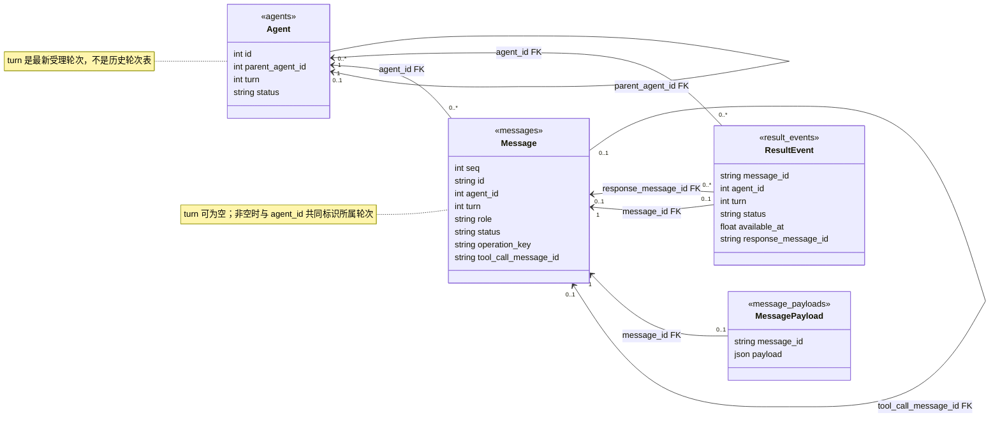

# Agent 历史与记忆接口

状态：持续对话、独立执行上下文、内部工具历史、控制受理和结果投递已实现。更新：2026-10-10。验证范围见 [运行与测试](CHAT_TESTING.md)。

## 身份与数据归属

用户始终与主 agent 1 对话；其 parent_agent_id 为 NULL。每项后台工作对应一个子 agent，parent_agent_id 指向 1；消息按 agent_id 归属。没有额外的 task、execution、session 身份，也没有前端 agent 管理接口。递归运行尚未开放。

消息 ID 标识记录；role 表示 user / assistant / tool；turn 是各 agent 独立递增的处理轮次。用户原话的 turn 为 NULL。子 agent 的 user 消息来自主 agent 交接，不代表用户切换了一段对话。

数据库默认保存在 macOS 的 `~/Library/Application Support/Olivia Lin Fan Pet/chat.sqlite3` 或 Linux 的 `${XDG_DATA_HOME:-~/.local/share}/olivia-desktop-pet/chat.sqlite3`。本地配置 database 或环境变量 OLIVIA_DB_PATH 可覆盖。SQLite 使用 WAL、外键和事务；进程文件锁保证单个 backend 写入。UI 不读数据库。

## 持久化结构

| 表 | 字段与用途 |
| --- | --- |
| agents | id、parent_agent_id、source_message_id、status、turn、created_at、updated_at |
| messages | seq（分页顺序）、id、agent_id、turn、role、content、status、source_message_id、operation_key、tool_call_message_id、model、error_code、usage_json、created_at、updated_at |
| message_payloads | message_id → payload；保存完整 assistant tool_calls / tool_call_id 协议消息，附属于历史记录 |
| result_events | 以来源 message_id 为主键，记录 agent_id、turn、status、available_at、response_message_id；结果投递附属记录 |

agent 状态为 idle / queued / running / waiting / cancelling / cancelled / completed / failed / interrupted；waiting 暂未使用。主 agent 回复结束回到 idle，子 agent 保留执行终态。消息状态为 completed / streaming / superseded / failed / interrupted。数据库约束唯一根节点、父 ID 小于子 ID，以及消息角色与 turn 的对应关系。

所有时间戳使用 UTC。result_events.available_at 是 Unix 秒数；其状态为 pending / report / suppress / suppressed。report、suppress 是主 agent 的处理决定，suppressed 是更新或撤回使旧事件失效。

### 存储 UML：外键与轮次归属

下图对应当前 SQLite 表，箭头指向被引用的记录。为便于阅读只展示主要字段与关系；时间戳、正文及 source_message_id 的来源引用省略。

`messages.seq` 是消息表主键，`messages.id` 是唯一消息标识，其他表的消息外键引用 id。其余表的主键分别为 agents.id、message_payloads.message_id、result_events.message_id。图中省略的 agents.source_message_id 和 messages.source_message_id 都外键引用 messages.id。

**逻辑上，模型和工具消息按 `(agent_id, turn)` 归属某一轮；物理上，当前只有 `messages.agent_id → agents.id` 外键，turn 是消息自身保存的轮次值，没有独立的 Turn 表。** 用户输入的 turn 为 NULL，直接归属持续对话中的 agent，不绑定某次回复；无轮次的运行时事实同样直接归属 agent。

例如 agent 2 已进入 turn 4，先前的消息仍保存 `(agent_id=2, turn=3)`。因此不能把消息的这两个字段外键指向 agents 的 `(id, turn)`：agents 只保留最新 turn，推进计数不能使旧历史失去引用，也不能级联把旧消息改成新 turn。轮次是否仍有效，由运行时比较当前计数和状态；这与消息是否仍应保留是两件事。

如果采用“Message → Turn → Agent”的物理外键结构，需要新增 `turns` 表，以 `(agent_id, turn)` 为复合主键、agent_id 外键关联 agents.id，再让消息引用它。那适合独立保存每轮的触发原因、起止时间和状态。目前这些调度需求由 agents、messages 和 result_events 满足，先保持现有最小结构。代码中的 `Turn` dataclass 只是当前主回复的内存状态，不是这张持久化表。

## Turn 的存储与事务

完整调度规则见 [Agent 架构的 turn 机制](AGENT_ARCHITECTURE.md#35-turn每个-agent-独立的处理轮次)。这里约束同一套规则如何落库，没有额外的 turn 表。

- `agents.turn`：非负整数，初值 0；表示已受理的最新轮次，结束和重启都不归零。主 agent 受理用户输入或空闲时启动结果回复才 +1；子 agent 创建/补充受理时 +1，queued → running 沿用计数。
- `messages.turn`：user 为 NULL，保留原话而不绑定一次回复；assistant 为正整数，工具调用和返回沿用所属 turn。运行时产生的停止等事实允许 role=tool、turn=NULL；这类事实的投递来源轮次由 result_events.turn 指定。
- `result_events.turn`：来源 subagent 的 turn，不是准备转述它的主 turn。有效 pending 要求事件 turn 等于来源 agent 当前 turn，且来源不处于 cancelling。事件仍用来源 message_id 去重；不用主 turn 标识结果。
- `AgentRuntime.decisions[turn]` 和 `observed_results[turn]`：只服务主 agent，保存本轮尚未提交的结果处理决定与本轮已看到的事件。主回复成功时原子提交决定；被替换、失败或退出则丢弃内存决定，保留 pending。
- `Turn.number`：对话服务正在运行的主轮次；Harness 显式接收启动时的 turn，不能在迟到协程中重新读取最新计数冒充新一轮。active_call 也保留原 turn。前端的 messageId 仅标识展示消息。

新输入受理的事务保存 user、推进主 turn、创建 assistant 草稿，并将被替换草稿标记 superseded。完成提交校验 agent_id、turn、message ID 和 streaming 状态；过期提交返回失败，不发送完成通知。子结果正文与事件原子提交；主回复与 report/defer/suppress 决定原子提交，决定提交时再次校验子结果是否仍有效。

创建/补充的事务同时保存凭据、子输入及新 turn；同键重放不再 +1。stop 通过状态停止执行，不创建新 turn。外部动作的凭据不依赖 turn；迟到工具返回仍归原 turn 保存为执行事实，不推进新一轮。TimerHandle 没有独立 turn，创建、取消及忙碌时的到期回调都不修改计数。

本项目使用当前结构新建数据库，不提供旧结构兼容、字段别名或迁移。已有开发数据库需要由开发者另行备份并选择新文件；运行时不自动删除历史。恢复当前结构时，保留计数、将未完成状态标记 interrupted，重新安排 pending 事件的唤醒，不自动续跑子 agent。

## 前台草稿与工具历史

1. chat/send 在事务中保存用户原话、推进主 agent turn、创建 streaming 草稿，然后返回空受理响应。
2. 新输入先推进主 turn 并把旧草稿标记 superseded，切换当前轮次后再取消旧的前台模型流；迟到的正文或新工具调用丢弃，旧轮次不自行重新触发。已受理后台工作、已完成工具调用及用户原话保留。
3. 正文从上游流式发到 UI，约每 250 ms 做持久化检查点；最终回复校验 agent、turn、message ID 和 streaming 状态。
4. 工具调用在执行前保存为独立 completed 消息，返回后追加关联的 tool 消息。completed 表示调用消息已完整保存，不表示动作已执行成功。外部动作中断时允许只有调用、没有结果；前台草稿被替换不删除这些事实。
5. ContextProvider 重建时按 agent 筛选有效历史，将结果紧跟在其调用之后重放，再放同 turn 的最终正文。若 steer 输入在调用与迟到结果之间落库，审计 seq 顺序保持原样，模型上下文仍保持调用/结果配对。没有结果的调用转为明确的运行时说明，不伪造 tool 返回，也不把缺配对的 tool_calls 直接发送上游。

## 工具调用消息就是操作凭据

不单独保存操作实体。工具名和参数在调用消息的 payload 中，结果在关联的 tool 消息中；执行、去重、审计、恢复使用同一份消息记录。

| 字段 | 含义与约束 |
| --- | --- |
| 调用消息的 operation_key | 可空且唯一。仅首次受理需要去重的调用占用此键；只有 assistant 消息允许设置 |
| 结果消息的 tool_call_message_id | 可空且唯一，外键指向原调用消息的 id；只有 tool 消息允许设置，每次调用至多一条结果 |
| payload.tool_calls[0].id / payload.tool_call_id | 上游模型协议的配对 ID，不能充当稳定的操作键，也不作为数据库关联依据 |
| 调用消息的 status=completed | 调用内容已保存完整，不表示动作已完成；是否有结果由关联的结果消息判断 |

每个工具调用保存为一条 assistant 消息；同一模型响应的多个调用按执行顺序逐一保存。结果消息沿用原调用的 agent_id 和 turn，消息 ID、seq 各自独立。工具名称、参数、返回结果不再复制到另一张操作表。

主 agent 控制工具没有外部 await：在同一事务中保存调用、受理子工作变更、保存结果，然后调度执行。失败则一起回滚，另保存本次调用与实际错误返回。子 agent 文件/命令涉及外部动作：先单独提交调用，才开始执行；实际返回后提交结果。SQLite 与外部动作没有共同事务，调用已落库但没有结果时，可能尚未执行，也可能已经产生效果，不能自动重做。

去重键沿用明确的作用域：主控制为 `1:source_message_id:operation_key`，子写入/命令为 `agent_id:operation_key`；不包含 turn 或上游 call ID。read_file、查询和结果处理决定不占用稳定键，每次调用仍保存普通工具消息。

收到重复键时，先从原调用 payload 核对工具名与参数。同键异参拒绝；已有结果则返回已记录结果，主控制则查询所指 subagent 的当前状态；没有结果则返回“结果未知，先核对”。重复请求本身保存新的调用/结果对，其 operation_key 列为空，原键仍只属于首次调用；模型原始参数中的键照常保存在 payload。新的拒绝或重放结果不会回填成原调用的执行结果。

`recorded_calls` 等快照由 keyed_tool_calls 查询消息时派生，不是额外的表、缓存或独立生命周期。get_subagent 直接返回完整消息历史和 active_call。缺失工具结果在模型上下文中只表现为明确的未知事实；原始 tool_calls 仍保存在审计历史里。重启保留这一缺口，不伪造成功、失败或取消结果。

## 创建、补充、取消和查询

内部工具为 create_subagent、steer_subagent、stop_subagent、get_subagent。它们只提供给主 agent，不注册为 JSON-RPC。

get_subagent(agent_id) 按需返回该直属 subagent 的全部已存消息，不按 turn、status 或最近条数截断。history 按原始 seq 排列，每项带消息元数据及解码后的 payload：输入、正文、streaming 检查点、superseded/failed/interrupted 草稿，以及 tool_calls 和 tool_call_id 对应的参数/结果都可以核对。它不是 ContextProvider 的有效对话过滤视图，旧 turn 和未完成内容必须结合状态判断。

同时返回 active_call（本进程当前在途工具调用，含 message_id、turn 和完整 call）。它的 message_id 直接指向 history 中执行前已保存的调用消息；结果通过 tool_call_message_id 关联该消息。查询时在调用消息上派生 execution_status：running 来自真实在途记录，result_recorded 表示已有结果消息，outcome_unknown 表示无结果且不在运行。返回错误或非零退出码也属于 result_recorded，不能因此宣称执行成功。中断或重启后 active_call 清空，原调用仍可查询；不会补写虚构的工具结果。

查询只读，不修改子 agent 的 turn、状态、消息，也不唤醒或中断其执行。查询返回会作为主 agent 自己的工具结果保存。默认在办快照仍只包含摘要，不自动注入全部子历史。全部历史指已经持久化的数据；不包含模型内部推理，也不恢复工具输出上限之外未保存的内容。

创建/补充/取消要求 source_message_id 引用主对话中的用户消息，并携带稳定 operation_key。存储键由父 agent、来源消息和该键组成，与当前 turn 无关。模型重生成时从已受理凭据中沿用键；重复键返回实际工作状态，同键异参拒绝。不同键的语义等价性仍由主 agent 判断，运行时不做文本语义去重。

主 agent 的调用消息、子输入/队列状态及结果消息在同一事务提交。创建提交后即返回，执行占用独立后台槽。第一版仅一个后台槽；前台模型调用不占用它。

补充保留原目标和历史，追加带来源引用的输入，推进子 turn，把旧草稿标为 superseded，并抑制旧的待报告事件。若有在途操作，先停下旧执行再启动新 turn；不会重新执行已记录的相同本地操作。

取消先禁止后续步骤：queued 直接 cancelled，running 先 cancelling，协程和进程组停止后才 cancelled。已完成工作仍保留 completed 的事实，但撤下尚未告知的成果事件。取消不回滚文件写入或外部动作。运行中取消最终产生“已停止”的结果事件，由主 agent 决定是否还需补充说明。

## 本地执行与未知结果

子 agent 可使用 read_file、write_file、run_shell。写入和命令都要求稳定 operation_key，存储键为子 agent ID 加该键。外部动作前先提交调用消息，返回后再追加真实结果消息。重复键重放已知返回，不重复执行；未知返回要求先核对实际状态，不自动重试。

文件操作在线程中执行，不阻塞前台事件循环；取消时等待在途文件调用结束。命令异步启动独立进程组，超时或取消时终止该组；任意 shell 仍能自行脱离进程组，本实现不是系统级沙箱或完整进程监管器。已发生的副作用不会自动撤销。

文件工具只接受工作目录内解析后的路径，shell 则拥有当前用户权限，可以访问目录外资源。工作目录不是权限边界。工具结果有大小上限；已配置的 API key 会从本地工具返回中脱敏，但不能承诺识别任意未知凭证。凭据、实际服务地址和模型配置不得提交到 Git；不保存模型内部推理正文。

## 结果回流与恢复

完整时序与取消/重建规则见 [结果暂缓与 Timer 方案](AGENT_ARCHITECTURE.md#51-subagent-结果暂缓timer-与提前询问)。新用户输入只取消内存 timer，不删除 pending 事件；主回复结束后根据剩余结果重新安排。

子结果和 pending 事件原子提交，以结果消息 ID 去重。前台空闲时事件唤醒主 agent；忙碌时排队，用户新输入可以替换结果回复草稿。只有主 agent 输出正文，执行者没有 UI 通道。

主 agent 调用 handle_subagent_results 选择 report、defer 或 suppress。决定先属于当前前台 turn；只有该回复成功持久化，才与回复一起提交投递状态。被替换、失败或退出的回复不会消耗结果。提交时再次核对来源子 turn 和状态。report 要求主 agent 在正文准确说明对应结果；运行时不能代替模型验证转述语义。

delay_seconds 仅在 defer 时有效，须为 1–300 秒；report/suppress 可填 0，运行时不应用延迟。暂缓时，主回复成功提交时将 result_events.status 保留为 pending，available_at 设为当前时间加延迟。结果正文始终保存在来源 subagent 的 messages，事件用 message_id 引用它，不复制到另一个暂缓结果表。

到期表示重新评估发言时机，不是直接展示正文：运行时在前台空闲时唤醒主 agent，由它结合最新对话再次选择 report / defer / suppress。前台忙时先等待，当前回复结束后会重新安排检查；已有但未处理的结果可能进入下述重试间隔。新用户输入也能让主 agent 提前看到待处理结果，例如用户主动追问时可以提前报告。suppress 只停止主动投递，不删除子历史，之后仍可通过 get_subagent 查询。

后台退出期间没有模型唤醒；重启后读取原有 available_at，未到期继续等待，已到期则安排检查。不要求用户再输入。无正文的暂缓/抑制不产生空 UI 文字流。未处理事件在成功回复后 30 秒重试，回复失败后 60 秒重试，不空转轮询。

启动将遗留 streaming、running、queued 和 cancelling 工作标记 interrupted，不自动续跑或重放命令。为未报告的中断生成一次结果事件，保留已完成未告知的结果，恢复其唤醒期限。关闭桌宠会停止本地 backend；没有脱离 UI 的 daemon。强制退出仍会丢失最后检查点后的草稿，且外部动作状态需要核对。

## 上下文接口与边界

ContextProvider 保留 refresh() / build(agent_id)。FullHistoryContextProvider 按 agent 组织全量有效历史；AgentRuntime 添加在办事项、从调用/结果消息派生的去重摘要、来源引用和待处理结果。主模型快照还包含 turn_trigger，由当前 ChatService 轮次传入；它是本轮调用信息，不是持久化字段，也不能证明历史气泡已显示。主 agent 决定交接哪些资料，子 agent 不自动获取完整日常聊天。ArkModel 只接收模型 messages、工具 schema 和思考设置，不接触 SQLite。

当前不做摘要、检索、token 裁剪、跨设备同步、数据库加密或历史管理界面。历史与运行快照随使用增长，超出模型上下文会明确失败。业务授权依赖主 agent 交接和执行提示，尚无独立命令审批 UI 或 OS 沙箱。
